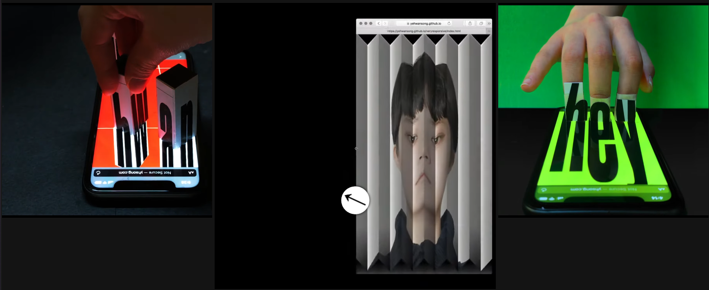
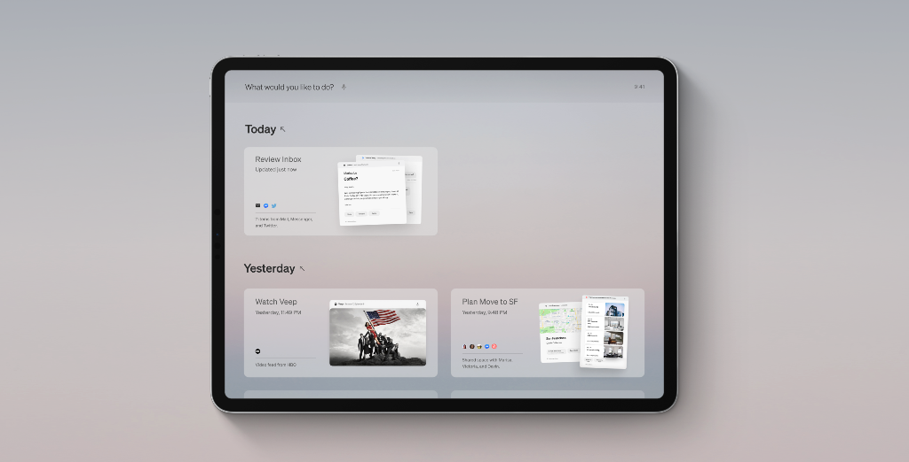
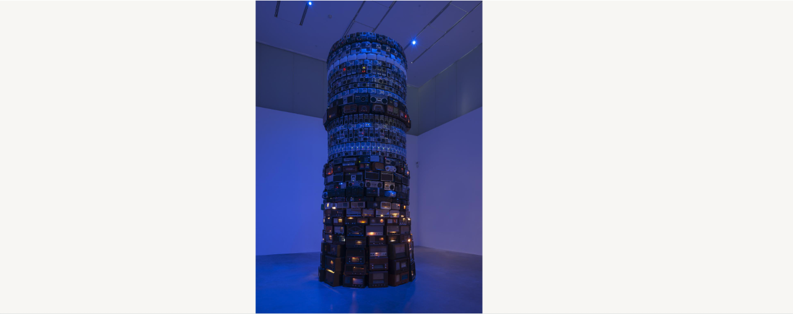
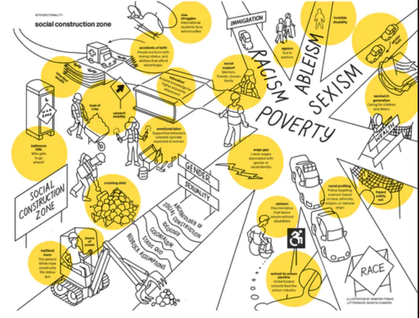
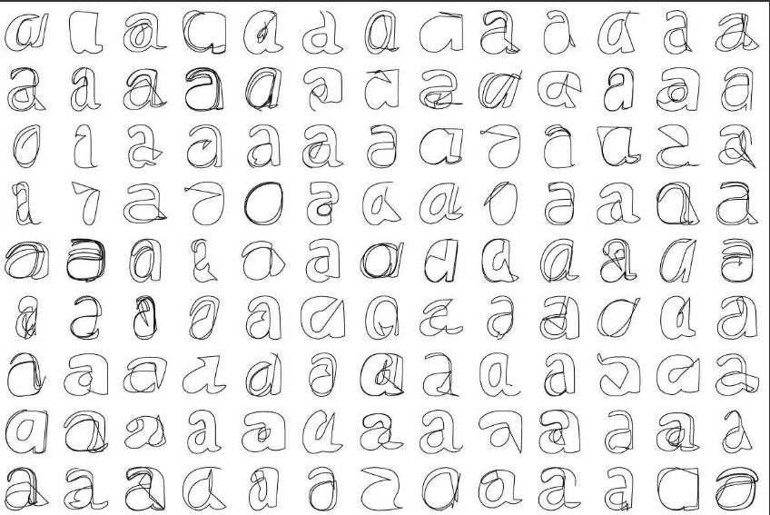

# 2022 Oct W2

`2022.10.17 - 10.23`

::: Goal

整理收集每周灵感的目的:

- 找到真正激起自己热情和兴奋的东西，反观自身。我到底想做什么？
- 好看的东西很多，只是也很多，但到底什么能够 inspire 我作为一个个体？

<button onClick={() => alert('button clicked!')}>变聪明按钮!</button>

:::

### 1. Yehwan Song

[Portfolio Website](https://yhsong.com/)

She focuses on extending the border of a website and making anti-user-friendly digital experience. 看到她的作品第一眼就是惊艳，怎么会有人这么想？怎么会有人这么做？在除了现存的现实之外，还有另一种现实的发展方式。虽然现在的我每天钻研怎么让东西好看，但这触动我思考：美丽的东西之外还有什么？什么能一直驱动我做设计？

### 2. Mercury OS (2020), Jason Yuan

[Project Website](https://uxdesign.cc/introducing-mercury-os-f4de45a04289)

因为总是被现有桌面为以名词来划分的系统所打断，他想用动词创建一个心流系统。

- 问题是，这个系统基于他自己的工作流和认识方式，如果名词会被分散在不同地方，那如何保证动词不会语义重复？
- 这套设计的思路很像语言学，如何构建一句话影响着人按照什么方式工作 —— 那是否有人是根据空间的方式工作，比如先到达什么位置再想干什么？有人是根据时间、有人根据动词，不同文化背景、语言和职业的人能够有多不一样？
- 最初苹果的用户体验与微软不同，但上手后爱不释手，因为他们找准了人的潜在需求和更适合人操作电子设备的体验方式 —— 如何能有下一个苹果？还能不能有这样体验上的突变？如何能有、如何又不能？

### 3. TED Talk 'The danger of the single story' (2009), Chimamanda Adichie

[Video Link](https://www.youtube.com/watch?v=D9Ihs241zeg&ab_channel=TED)

首先，idea 很棒，有很多可以延展出去的部分。其次，讲故事很到位，学习她如何：讲述观点具体且抽象 —— 不断点题、给出例子后直切要害。
单一故事的缺点是什么？抹杀完整的故事、只听一种声音，强调人的不同，而不是人的相同。
这是我非常在乎的主题，关乎到“为什么不能只有一种声音”、关乎到“人的偏见和开放性”、也关乎到“这个世界的一体两面”、还关乎到“一个细节是如何影响到一个社会，而一个社会又是怎么反作用于人”。

这个 talk 让我想到泰特的巴比伦塔 [Babel (2001), Cildo Meireles](https://www.tate.org.uk/art/artworks/meireles-babel-t14041)，刚来纽约的时候因为语言觉得什么都隔着层膜，看到这个项目震撼了。描述中说道：巴别塔是人类互不理解的象征，而在这样信息过载的“收音机”巴别塔中，希望能有一片即使嘈杂也能和而不同的乐土。原话如下：

> In describing this work, Meireles refers to a ‘tower of incomprehension’ (quoted in Tate Modern 2008, p.168). The installation manifests, quite literally, a Tower of Babel, relating it to the biblical story of a tower tall enough to reach the heavens, which, offending God, caused him to make the builders speak in different tongues. Their inability to communicate with one another caused them to become divided and scatter across the earth and, moreover, became the source of all of mankind’s conflicts.

> Dos Anjos suggests that **the presentation of informational overload in *Babel* can be seen as a metaphor ‘for the intricate relations between distinct nations and communities’ which insists on ‘recognising the existence of a territory with uncertain boundaries, one that accommodates multiple oppositions and produces the multiple contamination of cultural expressions previously separated by geographical and historical injunctions’** (dos Anjos 2008, p.173).

这个项目有趣的一点是，作者是如何获得灵感的？
第一，对外观结构相似、却因时代频率各有不同的收音机产生兴趣。
第二，通天塔的主题延伸开来，创作者和作家 Jorge Luis Borges (1899–1986) 产生共鸣：用声音用作雕塑和感知元素，且作家豪无界限的宇宙与艺术家对 expanded notions of space and of infinity, in an excess of perceivable information and the processes of cognition 的兴趣呼应 —— 在文学作品中寻找抽象的共鸣。

让我想起的另一个是 [Extra Bold (2021), Princeton Architectural Press](https://www.amazon.com/Extra-Bold-Inclusive-Anti-racist-Nonbinary/dp/1616899182/ref=asc_df_1616899182/?tag=hyprod-20&linkCode=df0&hvadid=564807226538&hvpos=&hvnetw=g&hvrand=16817767846468772366&hvpone=&hvptwo=&hvqmt=&hvdev=c&hvdvcmdl=&hvlocint=&hvlocphy=9067609&hvtargid=pla-1155723178976&psc=1) 中一副 [Social Construction Zone (2020), Jennifer Tobias](https://papress.com/pages/extra-bold) 的插图，有趣的点在于把社会上能影响人的大点变成大道，通过图像的方式展现不同领域的小细节怎么交叉影响一群人，我看完立即想要画一个中国版！

<!--truncate-->

### 4. Pathfinder (2020), by Jeon Bohm

[Project Website](https://jeanboehm.de/work/pathfinder)

在概念和技术手段上都让我看了叫绝的字体设计项目。看到项目第一印象是：技术路径聪明啊！不同于常规机器学习字体像素的方法，这个来自德国的设计师把字体转化为 SVG 文件丢给机器学习 —— 处理能生成字体矢量文件的直接数据，那可不比像素这种模糊中介聪明精准得多？

记录一些非常值得我学习的点：

- 整个项目过程中，他制作了两个小工具：proportion prediction tool，font-to-svg tool。为自己的创作过程制作工具，其实并非远在天边的事，应把“开发有利于优化个人创意过程的小工具”正式纳入创意过程中。比如我知道的 [undev.studio](https://undev.studio/) 开发了 [cables.gl](https://cables.gl/home)，[RNDR studio](https://rndr.studio/) 开发了以 Java 为基础的 [OpenRNDR 库](https://openrndr.org/) 用于创意编程和机器学习，平面设计 [burrow studio](https://im-burrow.com/) 正在开发继 [Prototypo (2016), Frederik De Bleser & Louis‑Rémi Babé](https://www.prototypo.io/) 之后的另一个参数化可变字体设计工具。正如 Rutherford Craze, founder of [Mass Driver](https://workshop.mass-driver.com/) 在 [Atypl - Tools for working with Fonts (2021)](https://www.youtube.com/watch?v=GbVsMUlsuYA&ab_channel=ATypI) 中提到，**创造自己的工具就是创造自己的生产方式。**
- 他最大化利用技术的限制把最初的设想变成现实。最初为了训练 vector data 找到唯一的矢量学习库 Sketch CNN；把 font 变成 stroke-3 格式寻找最少的矢量点；也尝试训练字形，并填充字形颜色；试验成功后转移到更好的学习库 GPT-2，同时决定利用 SVG data。

关于 Prototypo 再多说两句，我和室友说道可变字体后她朋友推荐了这个项目，发现破产后我在 github 中上下求索，发现必须用 API 才能使用 prototypo.js 库后我开始尝试直接用 opentype.js 配合 paper.js 制作可变字体，整个过程返回来看其实很简单，但走的时候一步步获得好多帮助，第一次在没有直接 tutorial 的情况下跌跌撞撞（此前脑电波项目是收到 gumi 帮助），成功尝试。开发者的演讲很好，保存食用 [Advance in JS-based font creation technologies and tools](https://www.youtube.com/watch?v=sDbwT6vUmCU&ab_channel=ATypI)

### 5. Fun Facts

- Date.now() 是 1970 年 1 月 1 日，类似于 B.C. / A.D.，属于编程界的常识。

### 6. Quotes

> 无常意味着瞬间生灭，世间不存在永恒，永恒只是一种假象。维持爱情永恒假象的唯一方法是一次又一次重新爱上。—— 王希明 [Original Link](https://mp.weixin.qq.com/s/muWPBTwiPsMC2T2zWl2tzg)

第一反应浪漫，再想想真理。和囧荡马路时她声情并茂用手语给我演示了这个关于爱的说法，脑海里第一个反应是 `function draw()` 假定每秒 30 帧，每一帧都在刷新，这一帧和上一帧不一样，每一帧都是一个新的屏幕状态，且刚好一帧就是人眼能捕捉到的样子。是否爱情就和动画一样，要每一帧都画上一个前进的小点才连得成一条明快的直线？如果 `function draw()` 是一台每一帧都有“无常“种状态的量子机器，函数的内容就是爱或不爱，那在时间和空间的维度上，这台机器会创造出什么呢？

> Create your own limitations.
> Limit yourself. Working with clear, defined limitations can greatly improve the consistency of your artwork. For example when creating pixel art try working with a fixed pixel size, fixed tile size, and limited palette. Use your visual references to help identify constructive limits!
> —— Justin Bakse

在艺术学校上学，外人以为难的是创作项目、制作艺术品，但其实”上课的学习方法“、”新技术的学习路径“、”寻找新技术最大化收益的 roadblock“、”激发创造力的方法“都需要自己创作，不仅创作作品本身、还要创造属于自己的创作方法。我目前理解拥有 ”limitations“ 的好处是，设计能更加贴合真实情况、更快出现有创意且可行的设计。
实习的上司给我分享过她在 facebook 产品设计开发完美团队合作的经验：产品拿来需求、开发提出限制。方向和限制有了，设计从使用角度出发、发挥创意，更重要的是利用最小化的努力和迭代，传递给后续开发。
